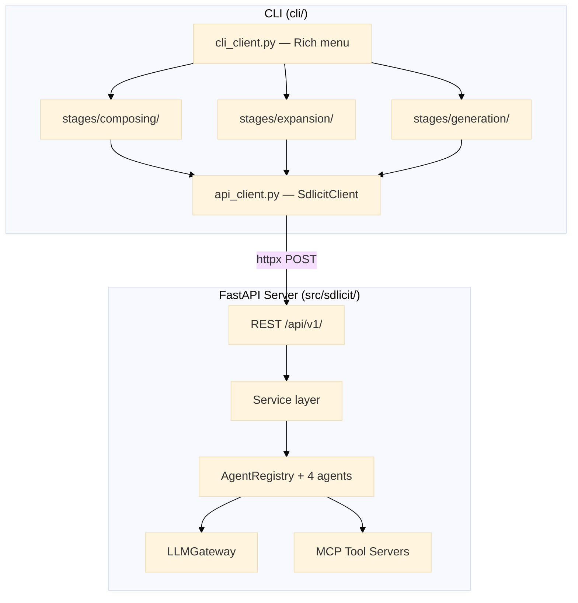

# Sdlicit — Architecture Visualizations

## High-level Architecture



## pyreverse UML Class Diagrams

Auto-generated by `pylint`'s `pyreverse` from AST analysis (no runtime execution needed).

| File                                                                    | Description                                |
| ----------------------------------------------------------------------- | ------------------------------------------ |
| [`classes_sdlicit.mmd`](visualizations/pyreverse/classes_sdlicit.mmd)   | Mermaid class diagram — all server classes |
| [`classes_sdlicit.svg`](visualizations/pyreverse/classes_sdlicit.svg)   | SVG class diagram (Graphviz rendered)      |
| [`classes_sdlicit.html`](visualizations/pyreverse/classes_sdlicit.html) | Interactive HTML class diagram             |
| [`classes_cli.mmd`](visualizations/pyreverse/classes_cli.mmd)           | Mermaid class diagram — CLI classes        |

---

## pyreverse Package Diagrams

| File                                                                      | Description                                 |
| ------------------------------------------------------------------------- | ------------------------------------------- |
| [`packages_sdlicit.mmd`](visualizations/pyreverse/packages_sdlicit.mmd)   | Mermaid package dependency diagram — server |
| [`packages_sdlicit.svg`](visualizations/pyreverse/packages_sdlicit.svg)   | SVG package diagram (Graphviz rendered)     |
| [`packages_sdlicit.html`](visualizations/pyreverse/packages_sdlicit.html) | Interactive HTML package diagram            |
| [`packages_cli.mmd`](visualizations/pyreverse/packages_cli.mmd)           | Mermaid package diagram — CLI               |

---

## py-code-visualizer Call Graphs

AST-based function call graph analysis (no code execution).

| File                                                                                 | Description                                                      |
| ------------------------------------------------------------------------------------ | ---------------------------------------------------------------- |
| [`sdlicit-callgraph.html`](visualizations/py-code-visualizer/sdlicit-callgraph.html) | **Interactive D3.js** — server call graph (zoom, search, filter) |
| [`sdlicit-callgraph.mmd`](visualizations/py-code-visualizer/sdlicit-callgraph.mmd)   | Mermaid call graph — server (109 functions, 60 calls)            |
| [`cli-callgraph.html`](visualizations/py-code-visualizer/cli-callgraph.html)         | **Interactive D3.js** — CLI call graph                           |
| [`cli-callgraph.mmd`](visualizations/py-code-visualizer/cli-callgraph.mmd)           | Mermaid call graph — CLI (34 functions, 29 calls)                |

---

## How to Regenerate

All tools are dev dependencies — install with `uv sync --group dev`.
Graphviz is required for SVG output (install via `nix-shell -p graphviz` or `apt install graphviz`).

```bash
uv run sdlicit-docs                        # run all tools
uv run sdlicit-docs --tool pyreverse       # only pyreverse UML
uv run sdlicit-docs --tool pyvis           # only py-code-visualizer call graphs
uv run sdlicit-docs --output-dir /tmp/vis  # custom output dir

# with graphviz for SVG output
nix-shell -p graphviz -- uv run sdlicit-docs
```

---
