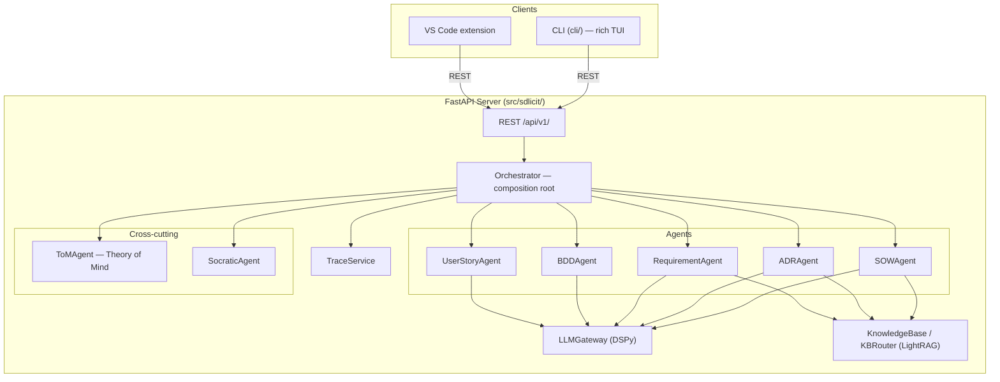

# Architecture

## How it fits together

```
CLI (rich) ──┐
             ├──httpx──▶ FastAPI server (src/sdlicit) ──▶ Orchestrator ──▶ Agents ──▶ LLM Gateway
VS Code ext ─┘                                                       └──▶ MCP tool servers
```

The backend starts uninitialised. A client (CLI or extension) calls `POST /api/v1/init` with a `project_dir`, which loads `<project_dir>/.sdlicit/config.yaml` and constructs an `Orchestrator` for that project (`sdlicit.bootstrap.create_system`). Everything the system produces or ingests lives under that project's `.sdlicit/` folder: config, knowledge base, generated artifacts, session logs.



## Orchestrator

`Orchestrator` (`src/sdlicit/orchestrator.py`) is the composition root: it builds the `LLMGateway`, the knowledge base (or a `StaticContextProvider` when RAG is disabled), the cross-cutting `ToMAgent` and `SocraticAgent`, then the five stage agents, injecting the shared services into each. There is no separate registry indirection; callers hold direct references.

## Stages

Sdlicit's stages map to the files under `src/sdlicit/`:

- **Composing** (`composing_stage/`) — SOW creation from a raw brief, ADR step-by-step review and full review, ADR direction suggestions.
- **Expansion** (`expansion_stage/`) — knowledge base tooling, Socratic elicitation, Theory of Mind, traceability analysis.
- **Generation** (`generation_stage/`) — SRS, personas, user stories, BDD/Gherkin.

## Knowledge base

`KnowledgeBase` wraps LightRAG. `KBRouter` adds per-agent store routing (`knowledge/` vs `artifacts/` vs both, configured via `config.kb_agent_stores`), probe gating (a cheap NetworkX check before paying for a full query), and artifact ingest/replace/delete with incremental chunk diffing. Chunking is structure aware per artifact type (`helpers/chunkers.py`): one chunk per ADR section, one per requirement, one per persona, and so on.

## Prior artifact context

Generation calls that need prior ADRs as context (`ADRAgent.suggest_directions`, `ADRAgent.full_review`) go through `helpers/context_budget.py`: candidates are ranked by relatedness to the topic (shared requirement ids first, word overlap second, recency last), kept in full while a token budget allows, summarised past that, and dropped past the budget with the drop count surfaced rather than silently truncated. The budget reuses `config.model_context_window` and `config.compact_threshold_pct`, the same fields `ToMAgent.compact_session()` uses for its own session log compaction.

This replaced an earlier implementation that read every ADR on disk on every call and passed a fixed slice, sorted oldest first by filename, as raw markdown straight into the prompt. Once a project grew past the slice size, the newest and most relevant ADRs were the ones silently dropped, and `ADRAgent.review_step` did the same disk read on every field review despite never using the result. The fix reused two pieces that already existed but were not wired in: `summarise_adr()`, written for exactly this purpose but never called from the generation pipeline, and the traceability layer's `implements` frontmatter, which already tracks which artifacts relate to which requirements.

## Ablation surface

The thesis validation framework sweeps a fixed set of configuration knobs, each isolating one subsystem or one cost versus fidelity trade off. All of them live on `SdlicitConfig` (`src/sdlicit/config.py`) and are set per project in `.sdlicit/config.yaml`.

| Knob | Values | What it isolates | Wiring |
|---|---|---|---|
| `enable_rag` | on / off | Contribution of knowledge grounding | `Orchestrator.__init__` — when off, no `KnowledgeBase` is built at all; agents fall back to `context_override` or an empty context. Hard gate. |
| `enable_tom` | on / off | Contribution of user-adaptive scaffolding | `Orchestrator.__init__` — when off, `self.tom` is `None` and every agent's `tom=` constructor arg is `None`. Hard gate. |
| `enable_socratic` | on / off | Contribution of the question-driven intervention loop | `Orchestrator.__init__` — when off, `self.socratic` is `None`. Hard gate. |
| `socratic_judge_mode` | dspy / hybrid / heuristic | Cost of LLM judgement vs length-based filtering | Passed straight into `SocraticAgent(judge_mode=...)`; each mode is a distinct code path in `socratic_agent.py`. |
| `tom_focus` | all / scaffolding / frustration / preferences | Per-dimension ToM contribution | Passed into `ToMAgent(focus=...)`. **Soft gate** — currently only prepends a `[ToM focus: X]` label onto the consult prompt; it does not restrict which fields the underlying signature computes or which session history is used. Isolating a single dimension for real would need either a per-focus signature or field-level filtering of the ToM output before it reaches downstream agents. Tracked as a known limitation, not fixed in this pass — see the roadmap doc. |
| `trace_check_mode` | structural / semantic / full | Depth vs cost of traceability analysis | `TraceService.from_config` uses it as the default mode; each mode is a distinct analysis path in `trace_service.py`. Hard gate. |
| `traceability_graph_source` | frontmatter / lightrag | Value of graph-extracted edges over declared ones | `Orchestrator._build_trace_graph` — `"lightrag"` calls `TraceGraph.from_project_and_kb`, `"frontmatter"` calls `TraceGraph.from_project` (frontmatter parsing only). Hard gate. |
| `agentic` | on / off | Deterministic pipeline vs ReAct tool-calling agents | `LLMGateway.predict_react` (a `dspy.ReAct` wrapper with tool functions from `expansion_stage/tools/rag_tools.py`) existed but had zero call sites before this pass — every agent always called the deterministic `predict()`, so this knob had no effect. Wired into `ADRAgent.full_review`: when `agentic=True`, the agent gets `query_knowledge_base` and `check_traceability` as tools and decides itself whether and how many times to call them, instead of one fixed KB lookup before a fixed `predict()` call. Deliberately scoped to this one call site for this pass rather than every agent — see the roadmap doc for extending it to `suggest_directions` and the generation-stage agents. |
| `context_override` | empty / fixed text | Agent logic in isolation from the retrieval engine | `KBRouter`/`StaticContextProvider` construction in `Orchestrator.__init__` — when set, every KB query returns this literal text instead of touching LightRAG, even with `enable_rag=True`. Hard gate. |

All fields are read once at `Orchestrator` construction time (project init). Changing one requires re-initialising the project (`POST /api/v1/init` again, or restarting the CLI session against the same `.sdlicit/config.yaml` after editing it) rather than a live toggle mid-session — consistent with these being setup-time ablation choices in the validation framework, not runtime user preferences.

## Diagrams

Auto-generated from AST analysis, no code execution needed. Regenerate with `pylint`'s `pyreverse` and [`py-code-visualizer`](https://pypi.org/project/py-code-visualizer/) (both `dev` group dependencies); Graphviz is needed for SVG output.

| File | Description |
|---|---|
| [`classes_sdlicit.html`](visualizations/pyreverse/classes_sdlicit.html) | Interactive UML class diagram — server |
| [`packages_sdlicit.html`](visualizations/pyreverse/packages_sdlicit.html) | Interactive package dependency diagram — server |
| [`sdlicit-callgraph.html`](visualizations/py-code-visualizer/sdlicit-callgraph.html) | Interactive D3.js call graph — server |
| [`cli-callgraph.html`](visualizations/py-code-visualizer/cli-callgraph.html) | Interactive D3.js call graph — CLI |
