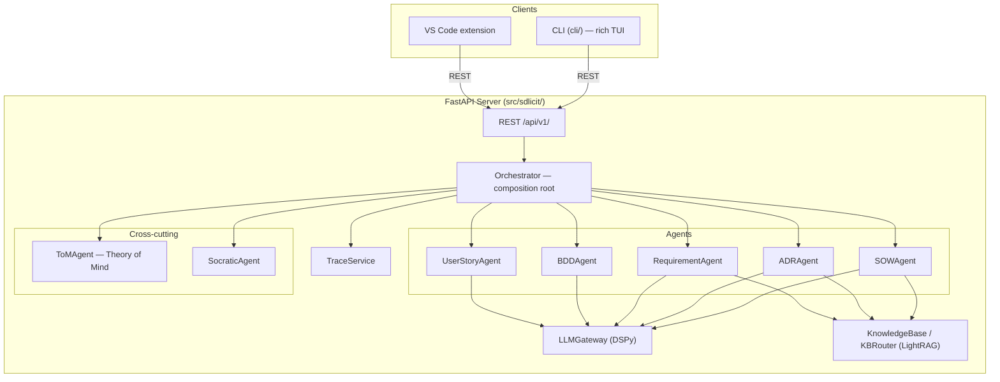

# Architecture

## How it fits together

```
CLI (rich) ──┐
             ├──httpx──▶ FastAPI server (src/sdlicit) ──▶ Orchestrator ──▶ Agents ──▶ LLM Gateway
VS Code ext ─┘                                                       └──▶ MCP tool servers
```

The backend starts uninitialised. A client (CLI or extension) calls `POST /api/v1/init` with a `project_dir`, which loads `<project_dir>/.sdlicit/config.yaml` and constructs an `Orchestrator` for that project (`sdlicit.bootstrap.create_system`). Everything the system produces or ingests lives under that project's `.sdlicit/` folder: config, knowledge base, generated artifacts, session logs.



## Orchestrator

`Orchestrator` (`src/sdlicit/orchestrator.py`) is the composition root: it builds the `LLMGateway`, the knowledge base (or a `StaticContextProvider` when RAG is disabled), the cross-cutting `ToMAgent` and `SocraticAgent`, then the five stage agents, injecting the shared services into each. There is no separate registry indirection; callers hold direct references.

## Stages

Sdlicit's stages map to the files under `src/sdlicit/`:

- **Composing** (`composing_stage/`) — SOW creation from a raw brief, ADR step-by-step review and full review, ADR direction suggestions.
- **Expansion** (`expansion_stage/`) — knowledge base tooling, Socratic elicitation, Theory of Mind, traceability analysis.
- **Generation** (`generation_stage/`) — SRS, personas, user stories, BDD/Gherkin.

## Knowledge base

`KnowledgeBase` wraps LightRAG. `KBRouter` adds per-agent store routing (`knowledge/` vs `artifacts/` vs both, configured via `config.kb_agent_stores`), probe gating (a cheap NetworkX check before paying for a full query), and artifact ingest/replace/delete with incremental chunk diffing. Chunking is structure aware per artifact type (`helpers/chunkers.py`): one chunk per ADR section, one per requirement, one per persona, and so on.

## Prior artifact context

Generation calls that need prior ADRs as context (`ADRAgent.suggest_directions`, `ADRAgent.full_review`) go through `helpers/context_budget.py`: candidates are ranked by relatedness to the topic (shared requirement ids first, word overlap second, recency last), kept in full while a token budget allows, summarised past that, and dropped past the budget with the drop count surfaced rather than silently truncated. The budget reuses `config.model_context_window` and `config.compact_threshold_pct`, the same fields `ToMAgent.compact_session()` uses for its own session log compaction. See [ADR-0001](adrs/ADR-0001-bound-and-rank-prior-artifact-context.md) for the full reasoning.

## Diagrams

Auto-generated from AST analysis, no code execution needed. Regenerate with `pylint`'s `pyreverse` and [`py-code-visualizer`](https://pypi.org/project/py-code-visualizer/) (both `dev` group dependencies); Graphviz is needed for SVG output.

| File | Description |
|---|---|
| [`classes_sdlicit.html`](visualizations/pyreverse/classes_sdlicit.html) | Interactive UML class diagram — server |
| [`packages_sdlicit.html`](visualizations/pyreverse/packages_sdlicit.html) | Interactive package dependency diagram — server |
| [`sdlicit-callgraph.html`](visualizations/py-code-visualizer/sdlicit-callgraph.html) | Interactive D3.js call graph — server |
| [`cli-callgraph.html`](visualizations/py-code-visualizer/cli-callgraph.html) | Interactive D3.js call graph — CLI |
